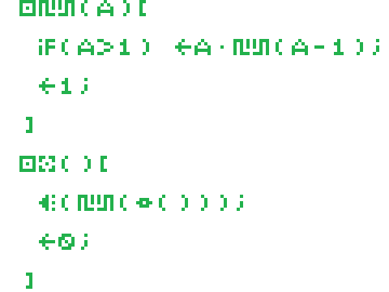
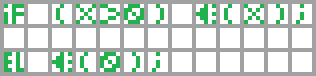
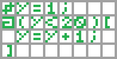
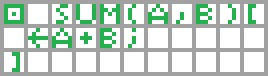

# Pixel
## Первый в мире художественно-ориентированный язык программирования

Pixel - это тьюринг полный язык программирования, где код представлен изображением, а все ключевые слова, имена переменных и функций представляют собой набор символов, каждый из которых является куском изображения размером 5x5.




## Фичи


- Встроенное дифференцирование арифметических выражений
- Около 33554400 свободных символов в алфавите
- Любой баг, которые вы обнаружите


## Особенности грамматики и синтаксиса


Изображение должно иметь **формат png** и **размер кратный шести** (5x5 значащих пикселей под каждый символ и разделяющая полоса в одни пиксель шириной справа и снизу для удобства рисования). Для "кодинга" подойдет любой редактор изображений, но могу посоветовать сайт [Pixilart](https://www.pixilart.com/).


### Основные правила


Каждое утверждение должно завершаться **точкой с запятой**


Арифметические выражения сами по себе или пустые строки, обозначенные точкой с запятой **запрещены**.

Все переменные имеют **вещественный тип с заданной точностью (не более 3 знаков после запятой)**.


### Числа


Основная сложность в том, чтобы запомнить их написание


Целая и дробная часть разделяются точкой


### Выражения


Классический пример


Математические операции


Логические операторы "и", "или", "не"


Операторы сравнения "==", "!=", ">", "<", ">=", "<="


### Идентификаторы


Существует список зарезервированных символов, использование которых для названий переменных и функций невозможно. Также размер идентификаторов не должен превышать 6 символов. В остальном, полная свобода творчества.


### Объявлений и присваивание переменных


Переменная объявляется с помощью ключевого слова 


Значение переменной должно быть указано при инициализации при помощи оператора присваивания


### Такие разные скобки


Для открытия и закрытия блока кода используйте квадратные скобки


В условном операторе, цикле, вызове и объявлении используйте круглые скобки


### Условный и циклический операторы


Пример условного оператора



Пример циклического оператора



Стоит сказать, что **скобки в условии обязательны.**

Образец условного оператора


Образец оператора "иначе"


Образец циклического оператора


### Функции


Пример функции



Функция объявляется с помощью символа


Список параметров перечисляется с помощью запятой


Оператор return обозначается


**Функция всегда должна возвращать значение!**

**Функция должна быть объявлена, до того как использована!**


### Комментарии


Пример комментария


Комментарий начинается и **обязательно** заканчивается символом


## Библиотечные функции


Эти функции присутствуют в программе с самого начала и вы можете смело их использовать, однако объявлять функции с такими же именами не стоит (кроме main, ее объявить вы обязаны).


### main


По аналогии с C/C++ основная функция, которая должна присутствовать в любой программе и именно с нее начинается исполнение программы. Обозначается


### read()


Считывает и возвращает одно число из входного потока. Обозначается


### print(value)


Печатает число в выходной поток. Обозначается


### sqrt(value)


Вычисляет квадратный корень из данного числа. Обозначается


## Компиляция


Для начала скачайте репозиторий и скомпилируйте командой 
```sh
make
```

Для конвертации изображения в AST-дерево используйте команду
```sh
.\front.exe -i <input_file> -o <output_file>
```

Для оптимизации AST-дерева используйте команду
```sh
.\middle.exe -i <ast_file>
```

Для конвертации AST-дерева в исполняемый файл используйте команду
```sh
.\back.exe -i <input_file> -o <output_file>
```

*В случае ошибки, смотрите консольный вывод. Все команды также оснащены параметром -h или --help*.


## License

MIT

**The Openest Source In The World**
